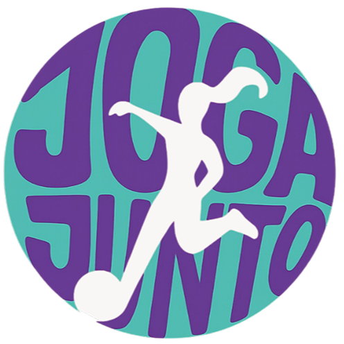

# Joga Junto

Clique aqui para acessar o 👉 [Joga Junto](https://www.jogajunto.com)  

## Visão do produto 👀
> Ser uma plataforma de referência que transforma e democratiza o futebol feminino, conectando de forma ágil clubes, jogadoras e olheiros, organizando e divulgando eventos, campeonatos e peneiras em um único hub digital — com foco especial em meninas e atletas de baixa renda.

## O que é ❓
**Joga Junto** é uma rede social para futebol feminino: perfis de jogadoras e clubes, feed de posts, divulgação de campeonatos e peneiras, e ferramentas para olheiros encontrarem e acompanharem talentos.

## Funcionalidades principais 🔨
- Perfis (jogadoras, clubes, olheiros)  
- Feed de posts com multimídia (fotos, vídeos)  
- Eventos: campeonatos e peneiras (criação, inscrição, resultados)  
- Busca/filtragem para olheiros  
- Mensagens e conexões entre usuários

## Tecnologias 💻
- Tailwind CSS  
- Headless UI  
- ReactJS

## Integrantes 👨‍💻
> Sala: 1ESPX
- **Thomaz Vasconcelos Mendes** 
- **Pedro Cunha Coutinho**  
- **Pedro Henrique dos Santos**
- **Nicolas Tetsuo Kimura**
- **Breno Henrique** 
